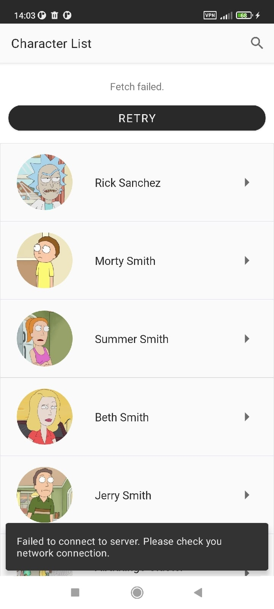

## Финальное задание курса по Android-разработке
___

### Описание приложения
1. Приложение состоит из двух экранов: список персонажей и детальная информация о персонаже.
2. Список персонажей фетчится из публичного API ([Rick And Morty API](https://rickandmortyapi.com/documentation)).
3. Данные кэшируются в локальную БД.
4. На главном экране предусмотрен функционал поиска по вхождению символов в имя персонажа.
5. Реализована пагинация списка персонажей на главном экране.
6. Проект многомодульный (разделение по фичам).

### Стек технологий
1. Lang: Kotlin
2. Arch: Clean Architecture + MVVM
3. Async: Coroutines + Flow
4. Navigation: Navigation Component
5. DI: Hilt
6. Cache: Room
7. Network: Retrofit + Moshi
8. Paging: Paging 3

Список персонажей          |  Детальная информация
:-------------------------:|:-------------------------:
|  

Поиск                      |  Загрузка
:-------------------------:|:-------------------------:
| 

Ошибка сети (кэш пуст)     |  Ошибка сети (есть кэш)
:-------------------------:|:-------------------------:
| 

